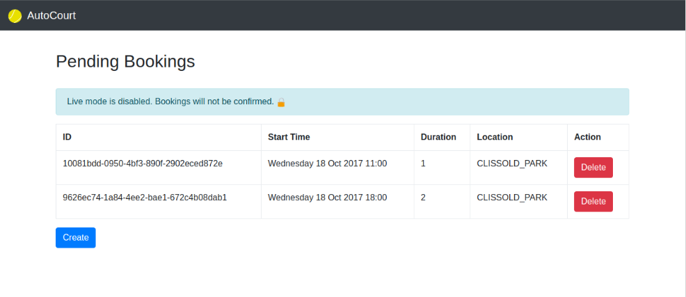

# AutoCourt
Automatic tennis court booking system for Hackney Tennis Courts.

## Running

1. Build with `maven bundle`
2. Execute with `java -jar target/AutoCourt-1.0.jar`

Optional parameters:

* Enable live mode (bookings will be confirmed): `--live`
* Enable Chrome headless mode: `--headless`

For example, `java -jar target/AutoCourt-1.0.jar --headless`

## TODO 

In priority order:

1. Automatic IP switching in deployment environment
2. ~~Finish REST endpoints~~
2. ~~Front-end!~~
3. Duration: recurrent bookings ~~and 2+ hours~~
4. ~~Different location IDs (Clissold Park and Aske Gardens)~~
5. ~~Build/deployment configured~~
